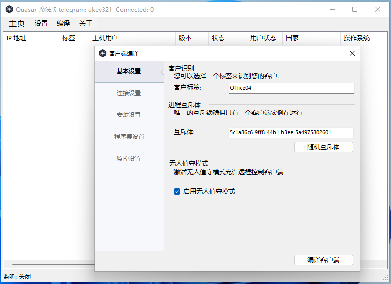
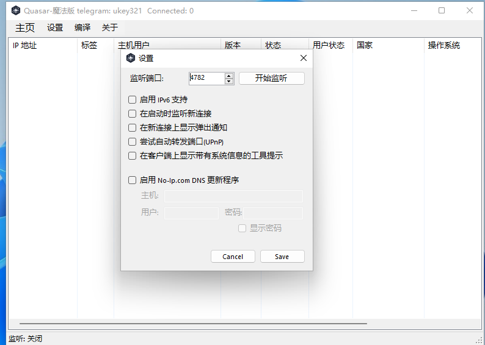
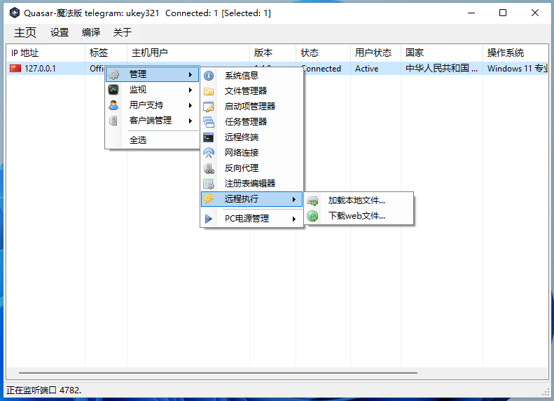
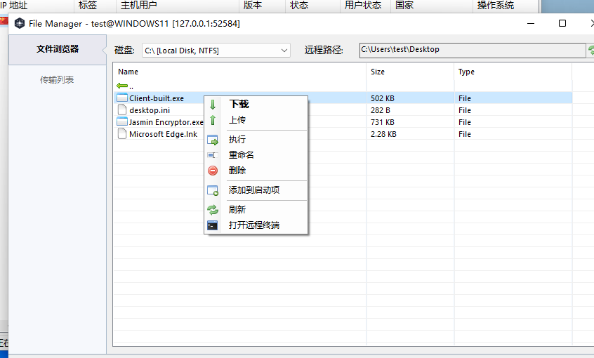

# Quasar

Quasar中文版本

由 ukey 修改 telegram： ukey321 email： amomo24680@gmail.com

*适用于 Windows 的免费、开源远程管理工具**

Quasar 是一个用 C# 编码的快速、轻量级的远程管理工具。使用范围从用户支持到日常管理工作再到员工监控。 Quasar 提供高稳定性和易于使用的用户界面，是您的完美远程管理解决方案。

